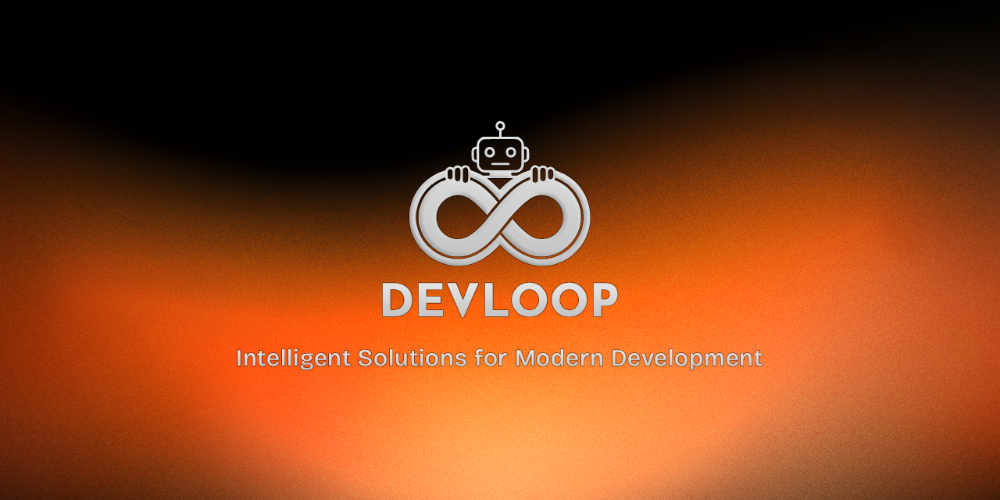

## About DevLoop

DevLoop is a forward-thinking technology company specializing in AI-powered solutions, modern web development, and intelligent automation. We bridge the gap between cutting-edge artificial intelligence and practical business applications, delivering scalable, production-ready systems that solve real-world challenges.

Our team combines deep expertise in machine learning, advanced web technologies, and automation engineering to create solutions that are not only technically excellent but also aligned with business objectives.

## Our Vision

To empower organizations with intelligent, automated systems that enhance productivity, streamline operations, and unlock new possibilities through the strategic application of artificial intelligence and modern software engineering.

## Core Services

<table>
<tr>
<td width="33%" valign="top">

### AI & Machine Learning
Custom AI model development, LLM integration with LangChain and LangGraph, intelligent agent systems, natural language processing, computer vision, and predictive analytics.

</td>
<td width="33%" valign="top">

### Web Development
High-performance full-stack applications with React, TypeScript, and Node.js. Server-side rendering, progressive web apps, FastAPI backends, and bilingual interfaces with RTL support.

</td>
<td width="33%" valign="top">

### Automation & Workflows
Business process automation, intelligent workflow orchestration with advanced tooling, data pipeline optimization, system integration, and custom automation solutions.

</td>
</tr>
</table>

## Technology Stack

## Our Approach

**Engineering Excellence** - We maintain high standards in code quality, architecture, and system design. Every solution is built to be maintainable, scalable, and performant.

**AI-First Mindset** - We leverage artificial intelligence not as a buzzword, but as a practical tool to solve complex problems efficiently and effectively.

**Business-Driven Development** - Technology serves business goals. We focus on delivering measurable value and ROI through our solutions.

**Continuous Innovation** - The technology landscape evolves rapidly. We stay current with emerging technologies and best practices to deliver modern, future-proof solutions.

**Quality Assurance** - Rigorous testing, code review, and validation processes ensure reliability and excellence in every deliverable.

## Featured Projects

<!-- 
This section will showcase our public repositories once available.
For now, we're working on exciting projects that will be shared soon.
-->

*Coming Soon* - We're currently developing open-source projects and tools that showcase our expertise. Stay tuned for:
- AI-powered development tools
- Automation workflow templates
- Modern web application starters
- Integration libraries and utilities

## Collaboration & Contact

We're always interested in challenging projects and meaningful partnerships. Whether you're looking to:
- Build an AI-powered application
- Modernize your web presence
- Automate complex business processes
- Develop multilingual platforms
- Integrate cutting-edge technologies

### Get in Touch

- **Email**: [contact@devloop.software](mailto:contact@devloop.software)
- **Website**: [www.devloop.software](https://www.devloop.software))
- **LinkedIn**: [linkedin.com/company/devloop](https://linkedin.com/company/devloop) *(Update with actual link)*
- **Twitter/X**: [@devloop_agency](https://twitter.com/devloop_agency) *(Update with actual handle)*

## Open Source Commitment

We believe in contributing to the developer community. As we grow, we'll be sharing tools, libraries, and resources that can benefit other developers and organizations working with AI, modern web technologies, and automation.

---

**DevLoop** - *Building intelligent systems that work*

© 2025 DevLoop. All rights reserved.

